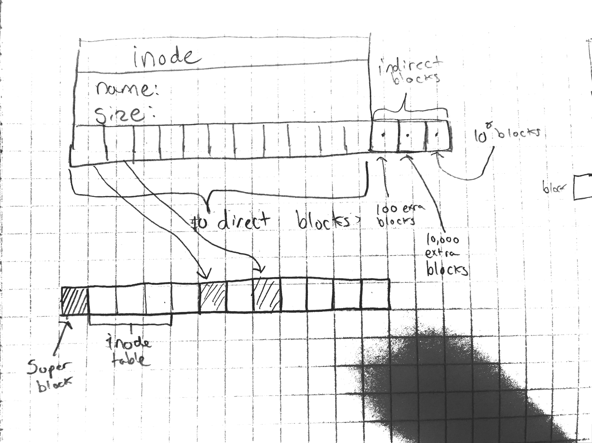

# Unix Filesystems

### Description
A filesystem is the methods and data structures that an operating system uses to keep track of files on a disk or partition; that is, the way the files are organized on the disk. The word is also used to refer to a partition or disk that is used to store the files or the type of the filesystem.

### Notes
* **Directories**
  * Always a root directory
  * Example file tree:
    * `root`
      * `dirA`
        * `fileA1`
        * `fileA2`
      * `dirB`
        * `dirC`
          * `fileC`
        * `fileB1`
        * `fileB2`
* Hard Disks
  * A series of *disks* or *platters* layered atop each other
    * Speed of the disks is constant represented in RPM for example, 5400 or 7200 RPM
    * They can have data surfaces on the top and bottom of the disk
  * There are *heads* that read and write data to the disks
  * Organizing the data
    * **Tracks**
    
      * Concentric circles around the disk
      * Each concentric circle is divided into *sectors*
      * Then each sector is represented on the sector by a *block*
        * Typically each block is about *512 bytes*
    * Imagine the blocks are represented in an array and are indexed as such with **`inodes`**
      * **Key inodes**
        * The "number" of the block is referred to as the `inode`
        * `blocks[inode] = file;`
        * The first block aka `blocks[0]` is referenced to as the **super block** which contains information on the filesystem and any data that is crucial to reading information on the disk
        * The next few blocks after that (`blocks[1->n]`) are part of the `inode` table
          * Contains information about the file owner and group and file size
          * The remainder of the array is where the data is stored
      * Each inode contains the name and filesize for the file, it then has two arrays
      
        * **Direct Blocks** - an array with links to blocks in the hard disk, there are 10 indices in this array, this goes up to 512 * 10 bytes so 5.12 kB, if the file is bigger than that, the indirect blocks are used
        * **Indirect Blocks** - an array with links to arrays of blocks (in three different indices)
          * 100 blocks (51.2 kB)
          * 10,000 blocks (5.12 mB)
          * 10^8 blocks (51.2 GB)
      * Each file can have anywhere from 1-511 unused bytes, which can be a concern if you have small sizes
        * If you downsize the block size, you will have to do more reads/writes to access the entire file if its a bigger file
        * If you upsize the block size, you will waste more space

### Pseudocode
